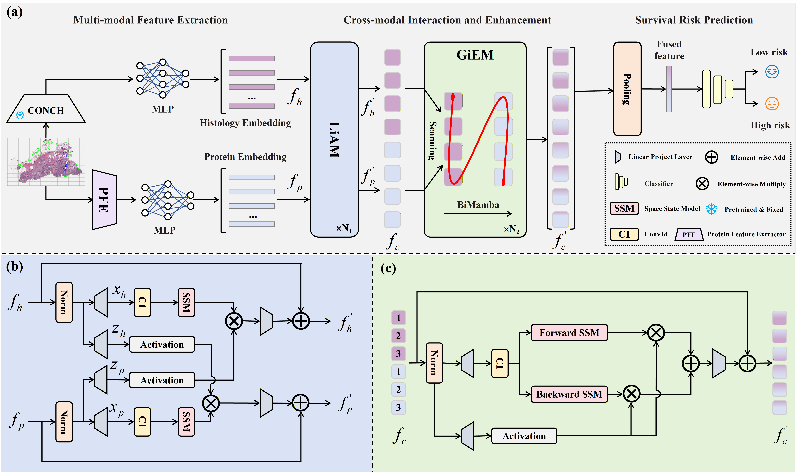

# HGP-Mamba: Integrating Histology and Generated Protein Features for Mamba-based Multimodal Survival Risk Prediction


## NEWS
**2025-03-13**: We released the full version of HGP-Mamba, including models and scripts.

## Abstract

> Recent advances in multimodal learning have significantly improved cancer survival risk prediction. However, the joint prognostic potential of protein markers and histopathology images remains underexplored, largely due to the high cost and limited availability of protein expression profiling. To address this challenge, we propose HGP-Mamba, a Mamba-based multimodal framework that efficiently integrates histological with generated protein features for survival risk prediction. Specifically, we introduce a protein feature extractor (PFE) that leverages pretrained foundation models to derive high-throughput protein embeddings directly from Whole Slide Images (WSIs), enabling data-efficient incorporation of molecular information. Together with histology embeddings that capture morphological patterns, we further introduce the Local Interaction-aware Mamba (LiAM) for fine-grained feature interaction and the Global Interaction-enhanced Mamba (GiEM) to promote holistic modality fusion at the slide level, thus capture complex cross-modal dependencies. Experiments on four public cancer datasets demonstrate that HGP-Mamba achieves state-of-the-art performance while maintaining superior computational efficiency compared with existing methods.

## Installation
* Environment: CUDA 11.8 / Python 3.8
* Create a virtual environment
```shell
> conda create -n HGPMamba python=3.8 -y
> conda activate HGPMamba
```
* Install Pytorch 2.2.2
```shell
> conda install pytorch==2.2.2 torchvision==0.17.2 torchaudio==2.2.2 pytorch-cuda=11.8 -c pytorch -c nvidia
```
* Install causal-conv1d
> Install `whl.` file from [here](https://github.com/Dao-AILab/causal-conv1d/releases) and find the corresponding version of your python and cuda.
* Install mamba-ssm
> Install `whl.` file from [here](https://github.com/state-spaces/mamba/releases) and find the corresponding version of your python and cuda.
* Other requirements
> The version of other requirements can be found in `environment.yml`.

## Data preparation
### WSIs
1. Download diagnostic WSIs from [TCGA](https://portal.gdc.cancer.gov/)
2. Use the WSI processing tool provided by [CLAM](https://github.com/mahmoodlab/CLAM) to extract CONCH pretrained 512-dim feature for each 256 $\times$ 256 patch (20x), which is then saved as `.pt` files for each WSI
3. Save the result in the `HNE_features` folder

### protein data
> In this work, we develop a protein feature extractor (PFE) that derives high-throughput protein features directly from WSIs using pretrained foundation models [ROISE](https://gitlab.com/enable-medicine-public/rosie.git).

1. Use the WSI processing tool provided by [CLAM](https://github.com/mahmoodlab/CLAM) to create non-overlapping patches of size $128 \times 128$ for every single WSI
2. Download the pretrained weights for [ROISE](https://gitlab.com/enable-medicine-public/rosie.git)
3. To extract protein features, specify the argument in the [bash](https://github.com/Daijing-ai/HGP-Mamba/blob/main/PFE/run.bash) and run the command:
```shell
> cd ./PFE
> bash pfe.sh
```
4. Save the result in the `protein_features` folder

The final structure of datasets should be as following:
```bash
DATA_ROOT_DIR/
    └──HNE_features/
        ├── slide_1.pt
        ├── slide_2.pt
        └── ...
    └──protein_features/
        ├── slide_1.pt
        ├── slide_2.pt
        └── ...
```
DATA_ROOT_DIR is the base directory of cancer type (e.g. the directory to TCGA_COADREAD), which should be passed to the model with the argument `--data_root_dir`.


## Training-Validation Splits
Splits for each cancer type can be found in the `splits/<CANCER_TYPE>` folder, which are randomly partitioned each dataset using 5-fold cross-validation. Each one contains splits_{k}.csv for k = 0 to 4.

## Running Experiments
To train HGP-Mamba, you can use the following generic command-line and specify the arguments:
```bash
CUDA_VISIBLE_DEVICES=<DEVICE_ID> python main_survival.py \
                                      --split_dir ./splits/<CANCER_TYPE> \
                                      --csv_path ./dataset_csv/<CANCER_TYPE>_processed.csv \
                                      --data_root_dir <DATA_ROOT_DIR>\
```

## Acknowledgements
Huge thanks to the authors of following open-source projects:
- [CLAM](https://github.com/mahmoodlab/CLAM)
- [MambaMIL](https://github.com/mahmoodlab/MambaMIL)
- [ROISE](https://gitlab.com/enable-medicine-public/rosie.git)


This code is available for non-commercial academic purposes. If you have any question, feel free to email [Jing Dai](daijing@mail.dlut.edu.cn).